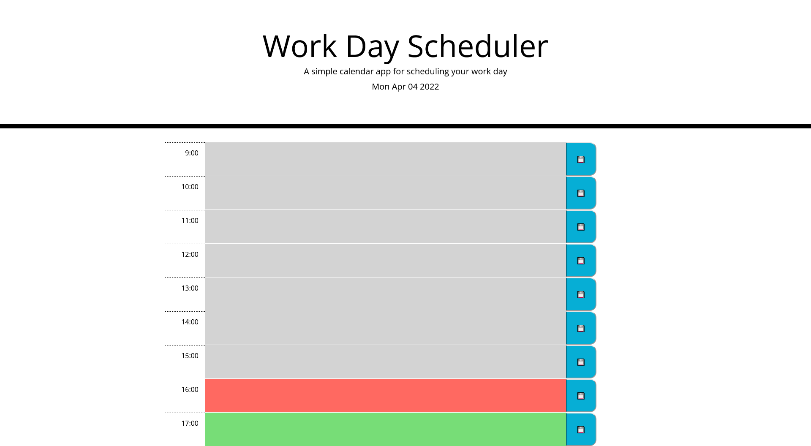

# Work Day Planner

challenge 5

## Online daily planner with following features:

- Up to date day of the week, day, and year at top of page

- dynamic hour blocks that change color to indicate if it's in the past, present, or future

- clicking on the blocks will allow the user to add or change calendar tasks

- save button will add task to calendar and save to localstorage for reload persistence

- work hours can be adjusted by changing the clockIn and clockOut values in the businessHours object

## [Deployed Site](https://carljmcgee.github.io/Work-Day-Planner/)

